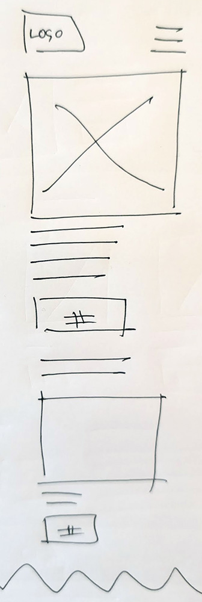
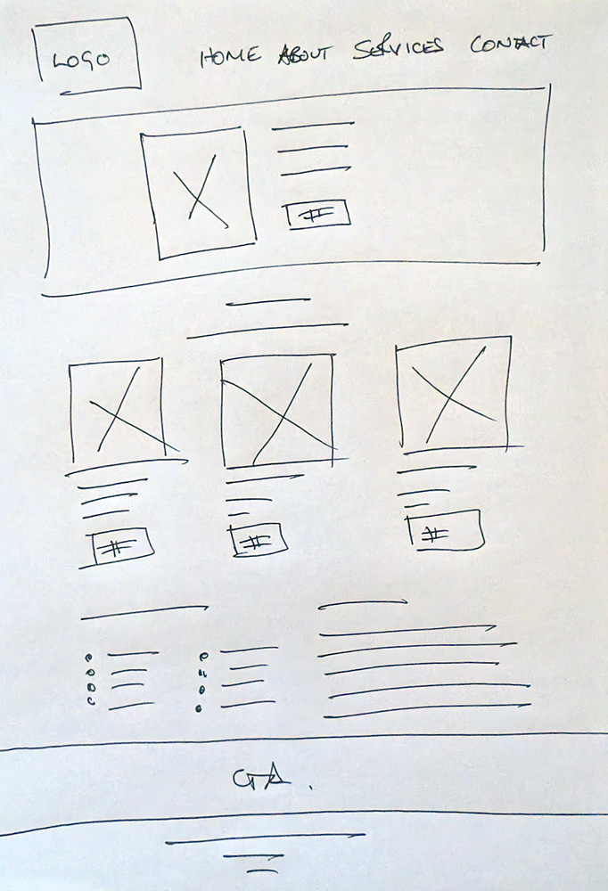

**Straight White Man**

Coding Institute DEI Project
paulabes
25/11/2024

## Table of contents

- Requirements
- Recommended modules
- Installation
- Configuration
- Troubleshooting
- FAQ
- Maintainers

**Introduction**

Navigating the evolving landscape of the modern workplace can present unique challenges for individuals who find themselves at odds with prevailing social norms. This website is dedicated to providing resources and support specifically tailored to straight white men over 50 who may feel alienated or frustrated due to their perspectives on topics such as diversity quotas, sexuality, masculinity and mental health.

We understand that generational and cultural differences can contribute to a sense of disconnect in today's workplace. Our mission is to empower individuals to confidently navigate these complexities, foster constructive dialogue, and bridge generational divides while maintaining their personal values.

**Primary goals**

1. **Celebrate shared experiences**  
    To provide a platform for straight white generation X men who are struggling to relate to modern DEI strategy in teh workplace. Teh website is a place to connect with each other, share stories, and celebrate aspects of their identity and experiences that are unique to them. This could include discussions about politics, interests, challenges, and achievements.
2. **Promote positive masculinity**  
    To explore and promote positive expressions of masculinity, encouraging healthy emotional expression, strong relationships, and responsible behaviours. This could involve discussions about how fatherhood, mentorship, and role models have changed.
3. **Build a supportive community**  
    To foster a sense of belonging and camaraderie among straight white men, providing a space where they can speak freely, feel supported, encouraged, and understood. This could involve the online forum, in-person meetups, or shared interest groups.
4. **Empowerment through open dialogue**  
    To create a space for open and honest conversations about the challenges and pressures faced by straight white men in today's society and especially thye modern workplace. This could include discussions about navigating changing social norms, DEI, workplace dynamics, and family expectations.
5. **Personal growth and understanding**  
    To provide resources and support for personal growth and development, helping individuals navigate life's new challenges, build resilience, and achieve their goals without putting their foot in it. This could involve articles, expert advice, or workshops on topics like stress management, modern communication norms, and learning to accept a narrative that you don't agree with.

**Notes**

Creating a positive and supportive community doesn't require exclusion or negativity towards others. By focusing on shared experiences, personal growth, and positive contributions to society, we can celebrate identity in a healthy way.

It's important to be aware that the concept for this website, while potentially aiming to provide support, can easily be misconstrued as promoting exclusivity. The challenges of straight white men are unique but should not inadvertently diminish the experiences of others.

The goal is to foster understanding and address feelings of marginalisation, here's a possible with a focus on ensuring the language promotes inclusivity and avoids any perception of superiority.

**Wireframe**

A very simple single column 'mobile first' design using standard Bootstrap elements will be created with media queries to fix responsive design issues. Micro-animations and layout effects could be added afer if time is remaining.

**> 768px**

**< 768px**

